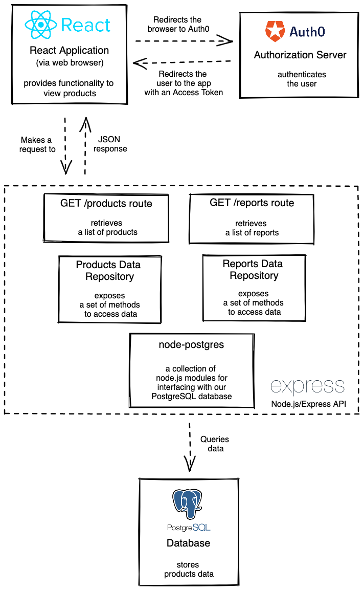
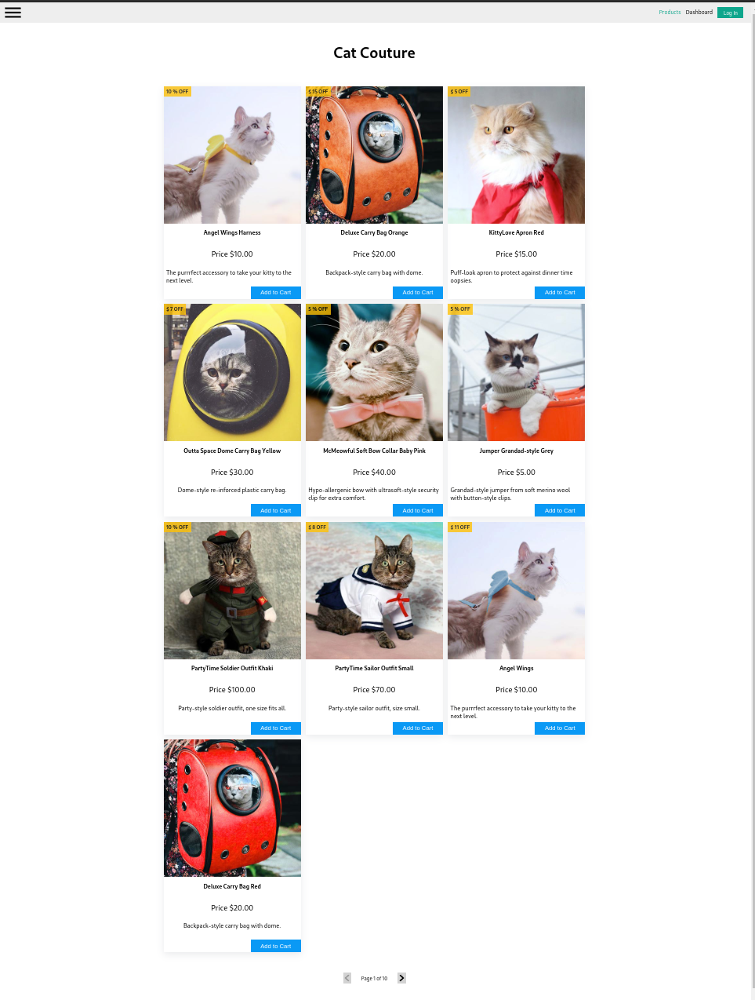

This project was part of my learning at Developers Institute NZ.

Cat Couture is an online shop that specializes in the latest cat fashion.

- A pagination feature, so that their customers can better view and link to the increasing variety of costumes that the shop now stocks
- An area of the site where their administrator can to log in and:
  - See the number of cat costumes in each product category that the shop sells
  - See the number of different products that are on promotion
- Only site user who have scope specified to them in auth0 dashboard can see the dashboard page

---

### Architecture Diagram



---

## Getting Started

**To run the app:**

```zsh
docker-compose up --build
```

---

## Screenshot


